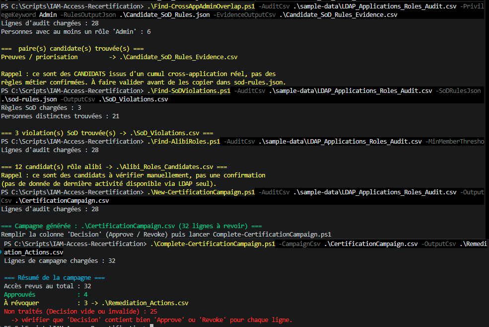
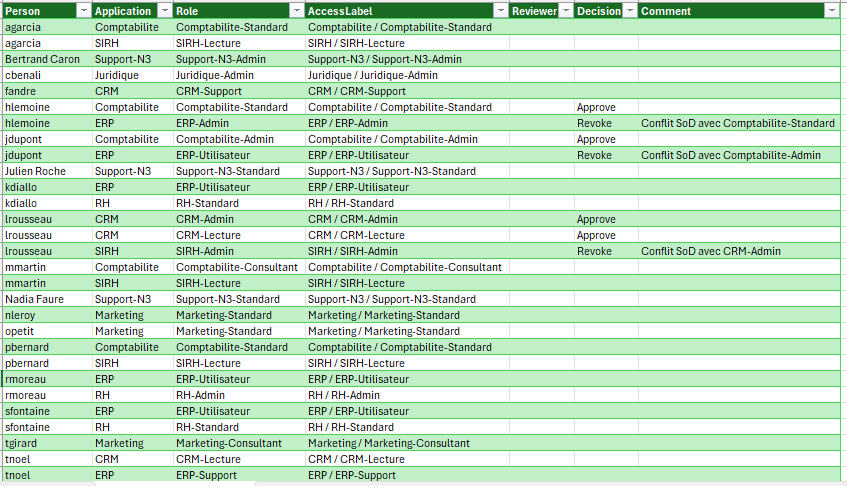

# 🔁 IAM Access Recertification


Boîte à outils PowerShell open source de gouvernance des accès IAM, inspirée des campagnes de
recertification type SailPoint IdentityIQ. Elle **ferme la boucle** de l'audit d'accès :

1. **Détecter** les violations de séparation des tâches (SoD)
2. **Repérer** les rôles "alibi" (définis mais quasi-inutilisés)
3. **Générer** une campagne de recertification à faire revoir par les propriétaires d'accès
4. **Traiter** la campagne remplie en actions de remédiation concrètes (accès à révoquer)

Prend en entrée le CSV produit par [LDAP-App-Role-Audit](https://github.com/Anne-LaureS/LDAP-App-Role-Audit)
(ou tout export au même format Application/Role/Members).

Contrairement à `LDAP-App-Role-Audit`, ces scripts ne dépendent d'aucune fonctionnalité
Windows — pur traitement CSV/JSON, testable et utilisable sous Windows, Linux ou macOS avec
PowerShell 7+.

## ⚙️ Les scripts (dans l'ordre d'exécution)

| # | Script | Rôle | Sortie |
|---|---|---|---|
| 0 | [`Find-CrossAppAdminOverlap.ps1`](Find-CrossAppAdminOverlap.ps1) | *(optionnel)* Amorce des règles SoD candidates quand `sod-rules.json` n'existe pas encore | `Candidate_SoD_Rules.json`, `Candidate_SoD_Rules_Evidence.csv` |
| — | *(revue métier des candidats, puis écriture de `sod-rules.json`)* | | |
| 1 | [`Find-SoDViolations.ps1`](Find-SoDViolations.ps1) | Détecte les personnes cumulant deux accès déclarés incompatibles | `SoD_Violations.csv` |
| 2 | [`Find-AlibiRoles.ps1`](Find-AlibiRoles.ps1) | Repère les rôles vides ou quasi-vides, candidats à nettoyer | `Alibi_Roles_Candidates.csv` |
| 3 | [`New-CertificationCampaign.ps1`](New-CertificationCampaign.ps1) | Génère une feuille de revue (1 ligne par personne + accès) | `CertificationCampaign_AAAA-MM-JJ.csv` |
| — | *(remplissage manuel de la colonne Decision par les reviewers)* | | |
| 4 | [`Complete-CertificationCampaign.ps1`](Complete-CertificationCampaign.ps1) | Traite la feuille remplie en liste de révocations | `Remediation_Actions.csv` |

## ▶️ Utilisation

Les commandes ci-dessous s'exécutent depuis la racine du repo et sont directement à
copier-coller.

### 0. Amorcer des règles SoD candidates (optionnel, si vous n'avez pas encore de sod-rules.json)

```powershell
.\Find-CrossAppAdminOverlap.ps1 -AuditCsv .\sample-data\LDAP_Applications_Roles_Audit.csv -PrivilegeKeyword Admin -RulesOutputJson .\Candidate_SoD_Rules.json -EvidenceOutputCsv .\Candidate_SoD_Rules_Evidence.csv
```

Repère les personnes qui cumulent un rôle contenant `-PrivilegeKeyword` (`Admin` par défaut,
insensible à la casse/accents) sur **deux applications différentes ou plus**, et génère une
règle SoD candidate par paire, avec la liste des personnes réellement concernées aujourd'hui
dans `Candidate_SoD_Rules_Evidence.csv` — pour prioriser la validation métier plutôt que de
partir d'une page blanche.

⚠️ **Portée volontairement limitée** : ce script ne détecte que les cumuls **privilège +
privilège** (ex: Admin sur l'application A et Admin sur l'application B). Un cumul asymétrique
(ex: Admin sur une application + simple accès Utilisateur sur une autre) peut tout autant être
un conflit métier réel, mais dépend du contexte fonctionnel des deux applications — un mot-clé
générique ne peut pas le déterminer sans risquer de multiplier les faux positifs (n'importe qui
ayant un accès ailleurs se ferait signaler). Ces cas-là restent à repérer manuellement en
inspectant l'audit, comme pour les 2 autres règles de l'exemple ci-dessous.

### 1. Détection des violations SoD

```powershell
.\Find-SoDViolations.ps1 -AuditCsv .\sample-data\LDAP_Applications_Roles_Audit.csv -SoDRulesJson .\sod-rules.json -OutputCsv .\SoD_Violations.csv
```

Les règles SoD sont définies dans un fichier JSON, une paire d'accès incompatibles par règle
(voir [`sod-rules.json`](sod-rules.json)) :

```json
[
  {
    "RuleName": "Nom de la règle métier",
    "Access1": "Application:Role",
    "Access2": "Application:Role"
  }
]
```

Un `Role` vide dans la clé (`"Application:"`) désigne l'accès direct à l'application elle-même
(pas via un rôle), au même format que la colonne `Role` de l'audit d'entrée.

[`sod-rules-examples.json`](sod-rules-examples.json) est un catalogue de règles SoD classiques
en entreprise (Finance, Achats, IT, RH, Sécurité, ITIL/SOX) — à adapter avec les vrais noms
d'application/rôle de votre annuaire ; ce ne sont que des exemples génériques, pas exécutables
tel quel contre `sample-data/`. Les règles réellement utilisées dans l'exemple ci-dessous
([`sod-rules.json`](sod-rules.json)) sont, elles, dérivées des cumuls constatés dans
`sample-data/`.

### 2. Détection des rôles alibi

```powershell
.\Find-AlibiRoles.ps1 -AuditCsv .\sample-data\LDAP_Applications_Roles_Audit.csv -MinMemberThreshold 1 -OutputCsv .\Alibi_Roles_Candidates.csv
```

Signale les rôles à 0 membre ("Vide") et ceux à `MinMemberThreshold` membre(s) ou moins
("Quasi-vide"). Ce sont des **candidats à vérifier manuellement** : sans données de dernière
activité (non disponibles via LDAP seul), le script ne peut pas confirmer qu'un rôle est
réellement obsolète, seulement qu'il mérite qu'on s'y penche.

### 3. Génération d'une campagne de recertification

```powershell
.\New-CertificationCampaign.ps1 -AuditCsv .\sample-data\LDAP_Applications_Roles_Audit.csv -OutputCsv .\CertificationCampaign.csv
```

Produit un CSV (ouvrable dans Excel/LibreOffice) avec une ligne par personne + accès, et des
colonnes vides `Reviewer`, `Decision`, `Comment` à faire remplir par le propriétaire de
l'application ou le manager concerné. `Decision` attend `Approve` ou `Revoke`.

### 4. Traitement de la campagne remplie

```powershell
.\Complete-CertificationCampaign.ps1 -CampaignCsv .\CertificationCampaign.csv -OutputCsv .\Remediation_Actions.csv
```

Lit la colonne `Decision` remplie (insensible à la casse) et produit :
- un CSV des accès à révoquer ([`Remediation_Actions.csv`](Remediation_Actions.csv) par défaut)
- un résumé en console : nombre d'accès approuvés, révoqués, et non traités (lignes où
  `Decision` est resté vide ou ne vaut ni `Approve` ni `Revoke`)

## 📊 Exemple de bout en bout

Avec les données d'exemple ([`sample-data/`](sample-data) — audit réel du lab Active Directory
décrit dans [LDAP-App-Role-Audit](https://github.com/Anne-LaureS/LDAP-App-Role-Audit), 8
applications et 21 utilisateurs) et les règles SoD dans [`sod-rules.json`](sod-rules.json)
(dérivées des cumuls constatés dans ce lab), sortie réelle obtenue en exécutant les 4 scripts à
la suite :

| Étape | Sortie |
|---|---|
| [`Find-CrossAppAdminOverlap.ps1`](Find-CrossAppAdminOverlap.ps1) | [`Candidate_SoD_Rules_Evidence.csv`](Candidate_SoD_Rules_Evidence.csv) — 1 candidat trouvé automatiquement : `lrousseau` (CRM-Admin + SIRH-Admin). Ne détecte pas les 2 autres cumuls ci-dessous (asymétriques Admin+non-Admin, hors de sa portée) |
| [`Find-SoDViolations.ps1`](Find-SoDViolations.ps1) | [`SoD_Violations.csv`](SoD_Violations.csv) — 3 violations : `jdupont` (Comptabilite-Admin + ERP-Utilisateur), `hlemoine` (ERP-Admin + Comptabilite-Standard), `lrousseau` (CRM-Admin + SIRH-Admin) |
| [`Find-AlibiRoles.ps1`](Find-AlibiRoles.ps1) | [`Alibi_Roles_Candidates.csv`](Alibi_Roles_Candidates.csv) — 12 candidats "Quasi-vide" (essentiellement les rôles Admin, à 1 seul membre chacun dans ce lab) |
| [`New-CertificationCampaign.ps1`](New-CertificationCampaign.ps1) | [`CertificationCampaign.csv`](CertificationCampaign.csv) — 32 lignes à revoir (1 par personne/accès), partiellement remplie ici à titre d'exemple |
| [`Complete-CertificationCampaign.ps1`](Complete-CertificationCampaign.ps1) | [`Remediation_Actions.csv`](Remediation_Actions.csv) — 3 révocations, correspondant aux 3 violations SoD ci-dessus |



La campagne se remplit à la main dans Excel/LibreOffice (colonne `Decision`) avant l'étape 4 :



## 🔐 Sécurité & précautions

- Ces scripts ne se connectent à aucun annuaire — ils ne consomment que des CSV/JSON déjà
  exportés. Aucune donnée d'authentification en jeu ici (voir
  [LDAP-App-Role-Audit](https://github.com/Anne-LaureS/LDAP-App-Role-Audit) pour la partie
  connexion LDAP).
- Le champ `Decision` est comparé en minuscules et sans espaces superflus (`.Trim().ToLower()`)
  pour tolérer les variations de saisie manuelle (`Revoke`, `REVOKE`, `revoke `) sans faux
  négatif silencieux.
- `Find-SoDViolations.ps1` et `New-CertificationCampaign.ps1` ne sautent que les lignes sans
  aucun membre (`Members` vide) — un `Role` vide reste un accès légitime (accès direct à
  l'application) à traiter, pas une ligne à ignorer.
- Les révocations produites par `Complete-CertificationCampaign.ps1` sont une **liste
  d'actions à exécuter manuellement** (ou via votre outil de provisioning existant) — ce
  script ne modifie aucun annuaire lui-même.
- **Fichiers `.ps1` et `.json` avec BOM UTF-8** : Windows PowerShell 5.1 lit mal les accents
  sans ce marqueur en tête de fichier (texte corrompu, voire erreur de syntaxe). Si vous
  éditez ces fichiers ou en ajoutez de nouveaux (ex: vos propres règles SoD), sauvegardez-les
  en UTF-8 avec BOM (`utf-8-sig`), pas en UTF-8 simple.
